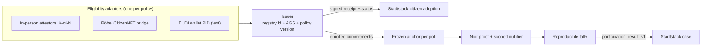

# stadtstack-participation

Municipality-neutral **eligibility issuer** and **anonymous advisory
participation** for [Stadtstack](https://github.com/GiraeffleAeffle/stadtstack).

- The issuer confirms that a person is eligible under one municipality's
  published policy and emits exactly the signed artifacts Stadtstack verifies:
  `municipal_civic_eligibility_receipt_v1`, the fresh
  `municipal_civic_eligibility_status_v1`, and the adoption acceptance
  receipt. How eligibility is established is an internal **adapter**; it never
  appears in a receipt.
- The participation lane lets eligible people answer advisory polls without
  revealing how they voted: identity commitments from a passkey PRF secret, a
  frozen anchor per poll, Noir membership proofs with nullifiers scoped to the
  municipality and poll, and a tally anyone can rebuild byte for byte. Results
  project to Stadtstack's `participation_result_v1` with
  `authorityBinding: "none"`.

> **Status: pre-release, not audited.** Use it for advisory pilots only, never
> for binding elections. Read the [threat model](docs/THREAT_MODEL.md) first.
> The EUDI wallet adapter is for tests against the EU test verifier only.



## Components

| Path | What it is |
|---|---|
| `src/issuer` | Policy validation, receipt/status/acceptance artifacts, NIP-98-authenticated requests, adoption ledger, commitment enrollment |
| `src/adapters/in-person-attestors.ts` | K-of-N in-person attestation with non-stacking renewal cohorts and distinct-attestor revocation; `in-person-attestation.ts` holds the shared wire format and subject codes |
| `src/adapters/roebel-citizen-nft.ts` | Bridge to Röbel's on-chain citizen status (`isActive`) with EOA, ERC-1271 and ERC-6492 wallet proofs |
| `src/adapters/eudi-pid.ts` | EU Digital Identity Wallet PID presentation (OpenID4VP) against a verifier backend; test-only, see [ADR 0006](docs/adr/0006-eudi-pid-adapter.md) |
| `src/vote` | Hashing, depth-16 Merkle anchors, PRF identity secrets, proving and verification, ballot intake, tally, Stadtstack result projection, chain checks |
| `src/http.ts`, `src/server.ts` | Web-standard request handler, static client hosting with security headers, and a `node:http` server |
| `web` | German web clients: participation at `/`, attestation at `/pruefung`; proofs are computed in the browser |
| `src/cli/operator.ts` | Operator CLI: issuer key, policy, poll draft, Safe transaction batches, tally, result |
| `circuits/membership_vote` | Noir membership circuit |
| `contracts/src`, `contracts/script` | `ElectionRegistry`, the generated UltraHonk verifier, and their deployment script |
| `Dockerfile`, `deploy` | Container image and Helm chart for a single-host deployment |
| `docs/DESIGN.md` | The normative contract for all of the above |

Eligibility is keyed by the Stadtstack registry unit id and the Amtlicher
Gemeindeschlüssel (AGS), never by postal code: postal areas cross municipal
boundaries.

## Requirements

| Tool | Version |
|---|---|
| Node.js | ≥ 22.18 |
| nargo | 1.0.0-beta.18 |
| bb (Barretenberg) | 3.0.0-nightly.20251104 |
| Foundry | ≥ 1.4 (forge, anvil) |

`Nargo.toml` cannot pin a prerelease compiler, so it states `=1.0.0`;
`scripts/build-circuit.mjs` refuses to build unless nargo and bb are exactly the
versions above.

## Develop

```sh
npm ci
npm run verify
```

`verify` runs the type checks (Node and browser), lint, the Node test suite
(including a Stadtstack interoperability test against Stadtstack's own pinned
verifier, end-to-end proofs generated with bb.js, and the operator lifecycle on
a local anvil chain), the Noir tests, the Foundry tests (including a real proof
verified by the Solidity verifier), the artifact reproducibility check, the web
build and the public-boundary scan.

`npm run web:dev` serves the clients with hot reload and proxies `/v1` to a
local server (`VITE_API_TARGET`, default `http://127.0.0.1:8787`).

After changing the circuit, regenerate and commit together, and replace the
browser CRS prefix described in `web/public/assets/crs/provenance.json`:

```sh
npm run circuit:build && npm run verifier:generate && npm run fixtures:build
```

## Run the service

```sh
npm run web:build
POLICY_PATH=./policy.json \
DATABASE_PATH=./eligibility.sqlite \
ISSUER_SIGNING_KEY_FILE=/run/secrets/issuer-ed25519.pem \
DISPLAY_NAME=Strausberg \
node src/server.ts
```

Serve it on its own host name, for example `mitmachen.stadtstack.eu`. Passkeys
are bound to that exact host; no other application may share it, and passkeys
must never be created for a parent domain (see
[Clients and hosting](docs/DESIGN.md#clients-and-hosting)).

| Variable | Meaning |
|---|---|
| `POLICY_PATH` | Public issuer policy (`municipal_eligibility_issuer_policy_v1`) |
| `DATABASE_PATH` | SQLite file for issuer and poll state |
| `ISSUER_SIGNING_KEY_FILE` or `ISSUER_SIGNING_KEY_SEED_HEX` | Exactly one; the Ed25519 issuer key (PKCS#8 PEM or 32-byte hex seed) |
| `DISPLAY_NAME` | Municipality name shown by the clients; required |
| `CHAIN_ID`, `REGISTRY_ADDRESS`, `PUBLIC_RPC_URL` | All three or none: the election registry the browser checks polls against |
| `PORT`, `HOST` | Listen address; defaults `3000` and `127.0.0.1` |
| `WEB_DIST_DIR` | Built web clients; default `web/dist` |
| `CLIENT_KEY_HEADER` | Behind a reverse proxy: a header the proxy **overwrites** with the client address (e.g. `x-real-ip`), so ballot rate limits are per client. Never set it when clients can reach the server directly |
| `ROEBEL_RPC_URL` | Required for the `roebel_citizen_nft_v1` adapter |
| `EUDI_UNIQUENESS_KEY_FILE` | Required for the `eudi_pid_v1` adapter: at least 32 random bytes, separate from the issuer key |

A policy pins the municipality, the eligibility basis, the issuer key and
endpoints, and one adapter:

```json
{
  "schemaVersion": "municipal_eligibility_issuer_policy_v1",
  "municipalityId": "sample-town",
  "ags": "12001001",
  "policyVersion": "policy-1",
  "registry": null,
  "issuer": "Sample eligibility issuer",
  "issuerKeyId": "issuer-1",
  "issuerPublicKey": "<64 hex: raw Ed25519 public key>",
  "publicBaseUrl": "https://eligibility.example",
  "statusBaseUrl": "https://eligibility.example/v1/eligibility/status",
  "acceptanceBaseUrl": "https://eligibility.example/v1/adoptions",
  "receiptTtlSeconds": 600,
  "statusMaxAgeSeconds": 60,
  "maxEventClockSkewSeconds": 30,
  "allowedAgentPubkeys": ["<64 hex: Nostr key of the city companion>"],
  "basis": { "residence": "main_residence", "minimumAgeYears": 16, "nationality": "any", "localityScope": null },
  "adapter": {
    "kind": "in_person_attestors_v1",
    "attestors": [
      { "attestorId": "attestor-a", "publicKey": "<64 hex>", "ownSubjectPubkeys": ["<64 hex>"], "validFrom": 1767225600, "validUntil": 1798761600 }
    ],
    "requiredAttestations": 2,
    "attestationWindowSeconds": 2592000,
    "validitySeconds": 31536000,
    "revocationThreshold": 2
  }
}
```

The example lists one attestor for brevity; a real policy needs at least
`requiredAttestations` attestors. `npm run operator -- policy` builds and
validates a policy from a pinned Stadtstack registry snapshot. `GET /v1/policy`
serves the policy, and `toStadtstackPolicy()` exports the pins a Stadtstack
deployment needs to verify this issuer. All endpoints are listed in
[docs/DESIGN.md](docs/DESIGN.md#http-endpoints).

## Documentation

- [Design](docs/DESIGN.md): normative wire formats, hashing, circuit, registry, issuer, adapters, clients
- [Threat model](docs/THREAT_MODEL.md): trust assumptions, residual risks, review scope
- [Operations](docs/OPERATIONS.md): registry deployment, operator CLI, poll lifecycle with a Safe
- [Deployment](docs/DEPLOYMENT.md): container, Helm chart and the owner-only release steps
- [Strausberg pilot runbook](docs/PILOT_STRAUSBERG.md): decisions and gates before inviting residents
- [Architecture decisions](docs/adr/README.md)
- [Security policy](SECURITY.md) and [contributing](CONTRIBUTING.md)

## Licence

MIT, see [LICENSE](LICENSE). The generated Solidity verifier is Apache-2.0
(Aztec); see [NOTICE](NOTICE).
